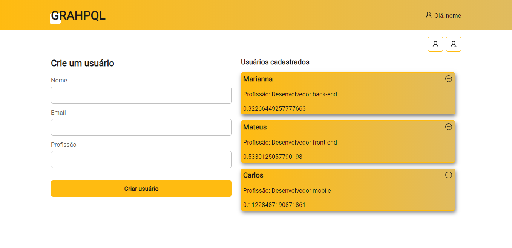

<h1 align="center">
Começo do GraphQL
</h1>

<h1>

</h1>

## 📝 Sobre:

O projeto está em desenvolvimento para aprimorar os conhecimentos da ferramenta GraphQL. 
Criei uma API básica, até então, apenas para pegar usuários e cadastrá-los. 
A api encontra-se no link a seguir: https://github.com/mlemos07/api-graphql.git

---

## 🚀 Tecnologias utilizadas

O projeto foi desenvolcido utilizando as seguintes tecnologias:

- React
- React icons
- GraphQL
- Apollo/Client

---

## 📦 Como baixar o projeto

```bash

    # Clonar o repositório
    $ https://github.com/mlemos07/front-graphql.git

    # Instalar as dependências
    $ npm install

    # Iniciar o projeto
    $ npm start

```

---

## ⚠ Observações:

- Para que o projeto funcione corretamente, é necessário que a api esteja em funcionamento paralelo. Portanto, disponibilizo o link da mesma: https://github.com/mlemos07/api-graphql.git

---

Desenvolvido por Marianna Lemos 💜.